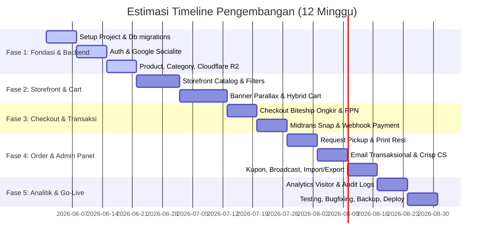

# RENCANA PENGEMBANGAN APLIKASI
## Toko Online PT Epoxyndo Art Lestari
**Versi 1.2 | Juni 2026 | Dokumen Teknis & Perencanaan Terintegrasi**

---

## 1. Tech Stack & Infrastruktur
Platform dibangun menggunakan arsitektur modern berorientasi performa, SEO, keamanan tinggi, lokalisasi bahasa, dan kemudahan manajemen data operasional.

### 1.1 Stack Utama
| Komponen | Teknologi & Keterangan |
| :--- | :--- |
| **Backend** | PHP 8.4 + Laravel 13 |
| **Frontend Storefront** | React.js + Inertia.js (SSR aktif untuk optimasi SEO produk) |
| **Admin Panel** | Filament v3/v5 + Filament Shield (manajemen hak akses staf) |
| **Bilingual Translation** | `spatie/laravel-translatable` + `@filamentphp/spatie-laravel-translatable-plugin` |
| **Database** | MySQL 8.0 |
| **Cache & Queue** | Redis (antrian email transaksional, broadcast, dan visitor logs) |
| **Storage File** | Cloudflare R2 (foto produk, PDF label resi, backup, S3-compatible) |
| **Server** | VPS minimal 2GB RAM + Swap Memory |

### 1.2 Layanan Pihak Ketiga (Third-Party)
| Layanan | Provider | Fungsi |
| :--- | :--- | :--- |
| **Payment Gateway** | Midtrans Snap | Transfer VA, QRIS, e-Wallet, Kartu Kredit |
| **Logistik & Resi** | Biteship API | Cek ongkir, booking pickup, cetak resi otomatis kargo/reguler |
| **Email Service** | Resend API | Notifikasi transaksional & broadcast promo terjadwal |
| **Live Chat / AI CS** | Crisp.chat | Customer support + AI assistant (free tier) |
| **Auth Sosial** | Google OAuth | Login instan menggunakan Laravel Socialite |
| **Keamanan Form** | Google reCAPTCHA | Proteksi bot/spam via reCAPTCHA v2 & v3 |

### 1.3 Palet Warna & Desain Brand
Palet warna brand PT Epoxyndo Art Lestari diatur secara konsisten di seluruh elemen UI (Storefront & Admin):
*   **Main Background (Off-White)**: `#F8FAFC` - Latar belakang halaman utama agar bersih dan mudah dibaca.
*   **Text & Headers (Slate Dark)**: `#0F172A` - Warna teks utama kontras tinggi namun nyaman di mata.
*   **Primary Accent (Hijau Epoxyndo)**: `#008943` - Digunakan untuk tombol utama (Submit, Save), header kecil, atau ikon navigasi aktif. (Warna tulisan logo Epoxyndo asli: `#00B857`).
*   **Secondary Accent (Pink Epoxyndo)**: `#E84296` - Digunakan untuk elemen krusial (Call to Action seperti Register/Beli Sekarang) dan notifikasi penting.
*   **Borders & Lines (Light Gray)**: `#E2E8F0` - Garis pembatas tabel, card, dan form input.

---

## 2. Struktur Folder Project
Pola arsitektur menggunakan *Controller-Service Pattern* yang memisahkan logika bisnis dari handler HTTP.

```plaintext
epoxyndo/
├── app/
│   ├── Http/
│   │   ├── Controllers/
│   │   │   ├── Auth/
│   │   │   │   ├── AuthController.php          # Login, register, logout
│   │   │   │   └── SocialiteController.php     # Google OAuth callback
│   │   │   ├── Shop/
│   │   │   │   ├── ProductController.php       # Catalog listing & detail
│   │   │   │   ├── CartController.php          # Cart operations (hybrid)
│   │   │   │   ├── CheckoutController.php      # Form checkout PPN & shipping
│   │   │   │   ├── OrderController.php         # Order history & detail (PDF download)
│   │   │   │   ├── WishlistController.php      # Wishlist products
│   │   │   │   └── LanguageController.php      # Switch language (ID/EN)
│   │   │   └── Webhook/
│   │   │       ├── MidtransController.php      # Webhook status pembayaran
│   │   │       └── BiteshipController.php      # Webhook tracking pengiriman
│   │   ├── Middleware/
│   │   │   ├── VerifyMidtransSignature.php
│   │   │   ├── VerifyBiteshipSignature.php
│   │   │   └── SetLocale.php                   # Set app language from session/cookie
│   │   └── Requests/
│   │       ├── CheckoutRequest.php
│   │       ├── ProductRequest.php
│   │       └── CouponRequest.php
│   │
│   ├── Services/                               # LAYER LOGIKA BISNIS UTAMA
│   │   ├── Auth/
│   │   │   └── AuthService.php                 # Registrasi & Google OAuth
│   │   ├── Shop/
│   │   │   ├── ProductService.php              # Paginasi, filter, views counter
│   │   │   ├── CartService.php                 # Merge cart guest vs login
│   │   │   ├── CheckoutService.php             # Kalkulasi PPN, ongkir, diskon
│   │   │   ├── CouponService.php               # Validasi kupon belanja
│   │   │   └── WishlistService.php
│   │   ├── Webhook/
│   │   │   ├── MidtransWebhookService.php      # Update status & stok via webhook
│   │   │   └── BiteshipWebhookService.php      # Update status resi via webhook
│   │   ├── Payment/
│   │   │   └── MidtransService.php             # Snap token & status sync
│   │   ├── Shipping/
│   │   │   └── BiteshipService.php             # Rates API & booking pickup
│   │   ├── Order/
│   │   │   └── OrderService.php                # Database order state, stock release
│   │   ├── Email/
│   │   │   ├── NotificationService.php         # Email transaksional
│   │   │   └── BroadcastService.php            # Broadcast marketing email
│   │   └── Storage/
│   │       └── R2StorageService.php            # Cloudflare R2 Upload & Delete
│   │
│   ├── Models/
│   │   ├── User.php
│   │   ├── Product.php
│   │   ├── ProductImage.php
│   │   ├── Category.php
│   │   ├── Cart.php
│   │   ├── Order.php
│   │   ├── OrderItem.php
│   │   ├── Shipment.php
│   │   ├── Coupon.php
│   │   ├── Banner.php
│   │   ├── Wishlist.php
│   │   ├── Review.php
│   │   ├── EmailCampaign.php
│   │   ├── EmailLog.php
│   │   ├── VisitorLog.php                      # Catat trafik human vs bot
│   │   ├── StockMutation.php                   # Audit trail stok barang
│   │   ├── AdminActivityLog.php                # Audit trail tindakan staf
│   │   └── Setting.php                         # Config pajak, gudang, reCAPTCHA
```

---

## 3. Struktur Database
Relasi menggunakan foreign key yang ketat dengan skema terpusat pada MySQL.

### 3.1 Tabel Utama & Audit Logs
| Tabel | Kolom Penting & Deskripsi |
| :--- | :--- |
| **users** | `id`, `name`, `email`, `google_id`, `role` (super_admin, sales_admin, inventory_admin, customer), `email_subscribed`, `last_order_at` |
| **products** | `id`, `name` (JSON untuk multilanguage), `slug` (JSON untuk multilanguage), `description` (JSON untuk multilanguage), `price`, `sale_price`, `sale_start`, `sale_end`, `weight`, `packaging_type`, `moq`, `stock`, `is_bulky`, `category_id`, `status` (active/inactive), `view_count` |
| **product_images** | `id`, `product_id`, `r2_url`, `is_primary`, `sort_order` |
| **categories** | `id`, `name` (JSON untuk multilanguage), `slug` (JSON untuk multilanguage), `parent_id` (null untuk level 1), `icon_url` |
| **carts** | `id`, `user_id` (nullable untuk guest), `session_id`, `product_id`, `qty` |
| **orders** | `id`, `user_id`, `status` (pending, processing, shipping, completed, cancelled), `subtotal`, `discount`, `shipping_cost`, `tax`, `total`, `coupon_id`, `midtrans_order_id`, `expires_at`, `notes` |
| **order_items** | `id`, `order_id`, `product_id`, `qty`, `price_snapshot`, `product_name_snapshot` |
| **addresses** | `id`, `user_id` (nullable), `recipient`, `phone`, `province`, `city`, `district`, `postal_code`, `full_address`, `is_default` |
| **shipments** | `id`, `order_id`, `courier`, `service`, `tracking_number`, `resi_pdf_url`, `status`, `biteship_order_id`, `picked_up_at` |
| **coupons** | `id`, `code`, `type` (fixed/percent), `value`, `min_purchase`, `max_uses`, `used_count`, `valid_from`, `valid_until`, `is_active` |
| **banners** | `id`, `title` (JSON untuk multilanguage), `image_url`, `link`, `is_active`, `sort_order` |
| **wishlists** | `id`, `user_id`, `product_id` |
| **reviews** | `id`, `user_id`, `product_id`, `order_id`, `rating` (1-5), `comment`, `is_approved`, `approved_at` |
| **visitor_logs** | `id`, `ip_address`, `user_agent`, `is_bot`, `visited_at` (Untuk analitik trafik web manusia) |
| **stock_mutations** | `id`, `product_id`, `order_id` (nullable), `admin_id` (nullable), `quantity`, `type` (in/out), `reason`, `created_at` (Audit stok) |
| **admin_activity_logs** | `id`, `user_id`, `action`, `description`, `properties` (json), `ip_address`, `created_at` (Audit aktivitas staf admin) |
| **settings** | `id`, `key`, `value` (Tarif PPN, lat/lng gudang, status reCAPTCHA, backup token, dll) |

---

## 4. Fitur Lengkap

### 4.1 Autentikasi & Keamanan
* **Google OAuth & Password**: Register/login via email/password tradisional atau instan menggunakan Google Socialite.
* **Guest Checkout**: Pembelian langsung tanpa wajib memiliki akun.
* **Role & Permission (Filament Shield)**: Pembagian akses Panel Admin yang jelas (Super Admin, Sales Admin, Inventory Admin).
* **Google reCAPTCHA v2 & v3**: Proteksi formulir penting (Register, Login, Checkout, Contact) dari ancaman bot dan spam.

### 4.2 Manajemen Toko (Admin Panel)
* **Manajemen Produk & Kategori**: CRUD produk beserta MOQ, berat, tipe kemasan (pail, sack, set), flag kargo (is_bulky), upload multi-foto produk langsung ke Cloudflare R2, dan kategori 2 tingkat.
* **Banner Parallax Manager**: Kontrol penuh untuk mengunggah gambar banner, mengatur tautan link, mengaktifkan/menonaktifkan banner, serta menyortir urutan banner halaman storefront.
* **Moderasi Ulasan (Review)**: Halaman khusus untuk membaca, menyetujui, atau menolak ulasan bintang 1-5 yang ditulis pembeli sebelum tampil di halaman produk.
* **Manajemen Pengguna**: CRUD akun pelanggan serta staf administratif.
* **Import/Export Excel**:
  * **Import**: Unggah data produk massal via Excel menggunakan template resmi.
  * **Export**: Unduh laporan penjualan, database produk, dan riwayat pesanan ke Excel/CSV.

### 4.3 Storefront & Pengalaman Pengguna (UX)
* **Banner Parallax Premium**: Tampilan visual storefront modern di bagian beranda.
* **Fuzzy Search & Filters**: Fitur pencarian produk toleran typo menggunakan Laravel Scout. Pencarian produk didukung filter kategori, jenis kemasan, kisaran harga, dan sorting.
* **Keranjang Hybrid & Merge**: Menyimpan barang belanjaan di LocalStorage bagi guest, otomatis digabungkan dengan database user begitu proses login sukses.
* **Wishlist**: Simpan produk favorit.
* **Cetak PDF Invoice**: Tombol khusus pada dashboard customer untuk mengunduh bukti invoice transaksi berformat PDF.

### 4.4 Checkout, Logistik & Pembayaran
* **Kargo Priority (Biteship)**: Cek tarif logistik real-time. Jika berat total pesanan masuk kriteria berat (bulky), sistem mengutamakan opsi ekspedisi Kargo.
* **Checkout dengan PPN & Kupon**: Penerapan kalkulator harga akurat (Subtotal - Diskon Kupon + Ongkir + PPN Dinamis sesuai pengaturan).
* **Midtrans Snap Popup**: Proses transaksi pembayaran langsung di dalam website.
* **Manual Sync Status**: Tombol khusus bagi admin untuk menyinkronkan status pembayaran/logistik ke API Midtrans & Biteship apabila webhook gagal terkirim (fallback system).
* **Auto-Release Stock**: Laravel Scheduler membatalkan otomatis pesanan yang kedaluwarsa (24 jam) dan mengembalikan stok barang ke inventori.

### 4.5 Sistem Email & CS Support
* **Email Transaksional (Resend)**: Notifikasi instan saat pesanan baru dibuat, lunas, dikirim (dengan no resi + tracking link), pembatalan, dan selesai.
* **Broadcast Email Promosi**: Membuat template email promosi dan mengirimkannya ke segmen pelanggan yang dinamis (Pelanggan VIP, Pelanggan Non-Aktif > 30 hari, berdasarkan kategori produk yang diminati).
* **Crisp AI Chat Widget**: Chatbot di pojok kanan bawah storefront untuk FAQ produk/status pesanan dan tombol eskalasi langsung ke WhatsApp Admin/Live Chat.

### 4.6 Pengaturan Sistem & Backups
* **Pajak & Gudang Dinamis**: Mengubah tarif PPN (misal 11% menjadi 12%) dan alamat gudang pengiriman (latitude & longitude) secara dinamis.
* **Backup Manager**: Pencadangan manual atau terjadwal untuk database SQL dan berkas media langsung ke Cloudflare R2.

### 4.7 Analitik, Dashboard & Audits
* **Sales Analytics**: Grafik penjualan harian/bulanan di dashboard admin.
* **Visitor Stats**: Mengukur trafik pengunjung unik website dengan filter bot yang akurat (manusia vs bot pencari).
* **Product Views**: Melacak produk yang paling sering diklik oleh pengunjung.
* **Audit Trail Lengkap**:
  * Log perubahan stok barang (Stock Mutations).
  * Log aktivitas admin (Admin Activity Log) untuk melacak perubahan harga, status pesanan, dll.

### 4.8 Fitur Multibahasa / Lokalisasi (ID & EN)
* **UI Static Translation**: Label, formulir, pesan error, dan tombol dalam bahasa Indonesia & Inggris menggunakan file JSON standar (`lang/id.json` dan `lang/en.json`) yang diteruskan ke React melalui Inertia.js shared data.
* **Database Dynamic Translation**: Menggunakan plugin Filament Spatie Translatable. Kolom krusial seperti Nama Produk (`name`), Deskripsi Produk (`description`), Slug (`slug`), Nama Kategori (`name`), dan Judul Banner (`title`) bertipe JSON di database untuk menyimpan teks multi-bahasa.
* **Locale Switcher**: Tombol dropdown/flag penukar bahasa (Indonesia & English) di storefront header, serta integrasi tab bahasa (ID | EN) di halaman edit produk/kategori admin panel.
* **SetLocale Middleware**: Mengamankan penentuan bahasa aktif di server berdasarkan session atau cookie pembeli.

---

## 5. Alur Sistem Utama

### 5.1 Alur Pembayaran & Webhook
```plaintext
Pembeli Checkout
   └─> Midtrans Snap Popup
          └─> Pembayaran Sukses / Gagal
                 └─> Midtrans kirim Webhook ke /webhook/midtrans (Diperiksa Middleware VerifySignature)
                        ├─> status = 'settlement' (lunas)
                        │     ├─> Order status -> 'processing' (Diproses)
                        │     ├─> Stok dikurangi secara aman (Audit Trail StockMutation tercatat)
                        │     └─> Kirim email konfirmasi sukses (via Queue)
                        └─> status = 'expire' / 'cancel'
                              ├─> Order status -> 'cancelled' (Dibatalkan)
                              └─> Stok dikembalikan (jika sudah didebet)
```

### 5.2 Alur Booking Pengiriman
```plaintext
Admin klik 'Request Pickup' (atau auto-trigger status lunas)
   └─> BiteshipService::bookPickup()
          └─> Response: biteship_order_id, tracking_number, label_url (PDF)
                 ├─> PDF label resi di-upload ke Cloudflare R2
                 ├─> Resi & PDF URL disimpan ke tabel shipments
                 ├─> Order status -> 'shipping' (Dikirim)
                 └─> Kirim email transaksional resi ke pembeli
```

---

## 6. Timeline Pengerjaan
Pengerjaan dibagi secara terstruktur dalam 5 fase (12 Minggu):



* **Fase 1 (Minggu 1–3)**: Setup DB & Migrations (Bilingual Support), Auth, CRUD Produk & Kategori (Translatable), R2 Storage, reCAPTCHA.
* **Fase 2 (Minggu 4–6)**: Catalog, Banner Parallax & Settings, Hybrid Cart & Merge, Locale Switcher Storefront.
* **Fase 3 (Minggu 7–8)**: Checkout, Biteship Ongkir, Midtrans Snap, Webhooks & Fallback Sync, Cetak Resi.
* **Fase 4 (Minggu 9–10)**: Kupon, Moderasi Ulasan, PDF Invoice, CS AI Chat, Broadcast Email Kampanye, Import/Export Excel.
* **Fase 5 (Minggu 11–12)**: Visitor & Product Analytics, Backup System, Audit Trail (Stock & Admin), Bug fixing, Deploy.